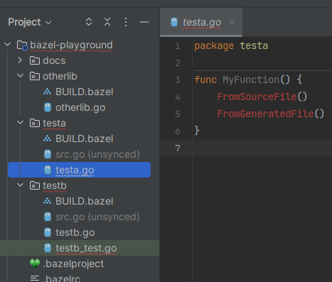
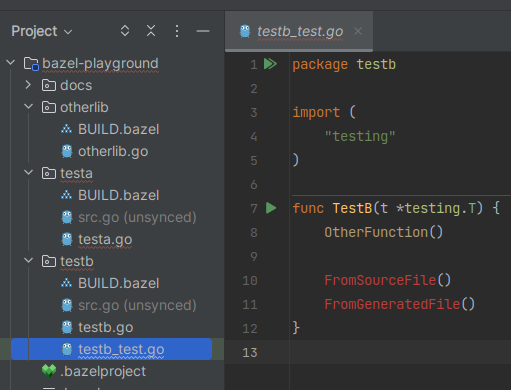
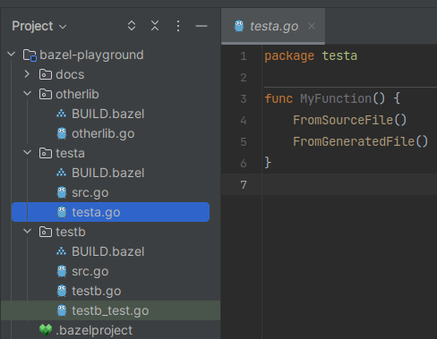
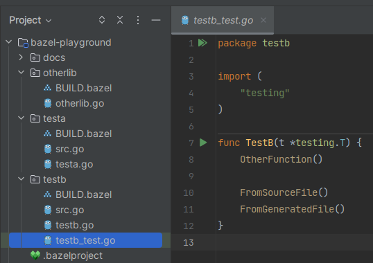

# bazel-playground - Intellij / go_source

The goal of this environment is to test [Bazel Intellij plugin] for a [Go] project
using a [go_test] and a [go_library] with embedded [go_source] rule containing:

- Source files
- Generated source files
- Go dependencies.

## Before

| `testa` Go library                      | `testb` Go test                           |
|-----------------------------------------|-------------------------------------------|
|  |  |

## After

| `testa` Go library                     | `testb` Go test                          |
|----------------------------------------|------------------------------------------|
|  |  |

[Bazel Intellij plugin]: https://ij.bazel.build/
[Go]: https://go.dev/

[go_source]: https://github.com/bazelbuild/rules_go/blob/master/docs/go/core/rules.md#go_source
[go_test]: https://github.com/bazelbuild/rules_go/blob/master/docs/go/core/rules.md#go_test
[go_library]: https://github.com/bazelbuild/rules_go/blob/master/docs/go/core/rules.md#go_library
